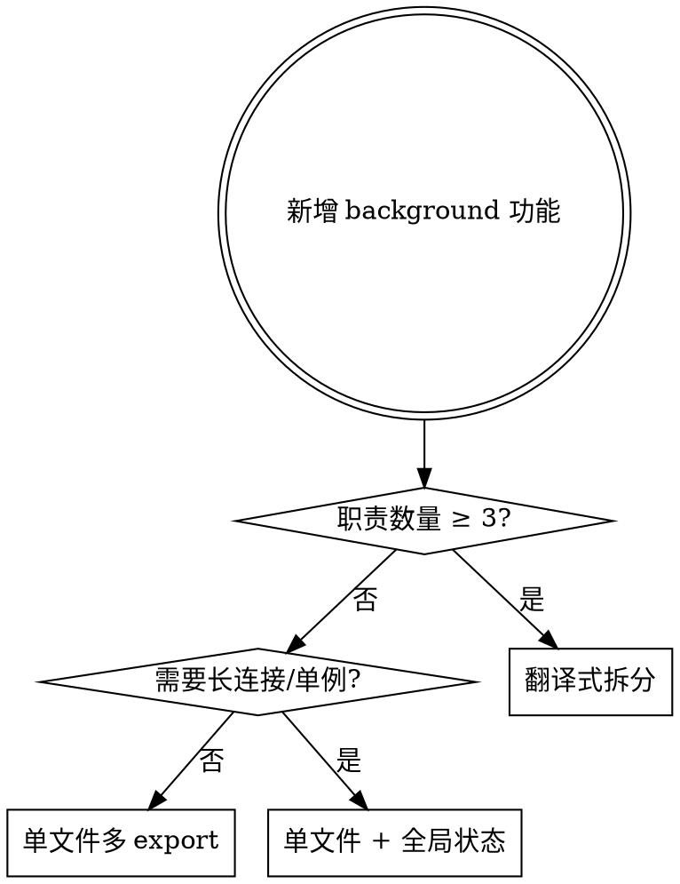

# Chrome Extension Background 模块化开发规范

> 本规范基于 `bro_chat` 项目的实战代码，以 `backgroudtask/translation/` 为优雅样板。
> 目标：让 `background.js` 永远只做"启动器"，业务逻辑全部下沉到子模块。

## 1. 何时使用本 Skill

- 在 `backgroudtask/` 下新增子模块（如翻译、OCR、绑定、Native 中继等）
- `background.js` 已超过 80 行或开始出现业务逻辑分支
- 多个监听器（`chrome.runtime.onMessage`、`chrome.contextMenus.onClicked`、`chrome.commands.onCommand`）同时存在
- 跨模块出现 action 名称冲突或 storage key 冲突

## 2. 顶层目录约定

```
extension-root/
├── background.js                ← 唯一的 service worker 入口（只做聚合）
└── backgroudtask/               ← 所有 background 子任务
    ├── translation/             ← 复杂模块：多文件拆分（优雅样板）
    │   ├── index.js             ← 聚合入口，只导出 setupTranslationModule()
    │   ├── contextMenu.js       ← 右键菜单职责
    │   ├── messageHandler.js    ← 消息分发职责
    │   ├── storage.js           ← chrome.storage 初始化/监听职责
    │   ├── ocr.js               ← OCR 截图职责
    │   └── selectionAskConfig.js
    ├── binddom/                 ← 中等模块：单文件 index.js 内多 export
    │   └── index.js
    ├── html_text_reader/        ← 简单模块：单文件
    │   └── index.js
    └── native_relay/            ← 单例长连接模块
        └── index.js
```

**关键决策树**



职责包括：contextMenu / commands / messageHandler / storage / 外部 API 调用 / 长连接 / 截图等。

## 3. 主入口 background.js 规范

**必须遵循的模式**：纯 import + 顺序调用 setup。不允许在 `background.js` 写业务逻辑。

```javascript
// background.js
console.log('[Background] Service Worker 启动');

// === 顶层 import 所有模块的 setup 函数 ===
import { setupTabUpdateListener, setupMessageListener as setupAIProcessorListener }
    from './backgroudtask/ai_platform_processor.js';
import { setupTranslationModule }
    from './backgroudtask/translation/index.js';
import { setupBinddomCommandListener, setupBinddomMessageListener }
    from './backgroudtask/binddom/index.js';
import { setupHtmlTextReaderListener }
    from './backgroudtask/html_text_reader/index.js';
import { setupNativeRelay }
    from './backgroudtask/native_relay/index.js';

// === 按顺序启动 ===
setupTabUpdateListener();
setupAIProcessorListener();
setupTranslationModule();
setupBinddomCommandListener();
setupBinddomMessageListener();
setupHtmlTextReaderListener();
setupNativeRelay();

console.log('[Background] 所有模块已启动');
```

**禁止事项**
- ❌ 在 `background.js` 内 `chrome.runtime.onMessage.addListener(...)`
- ❌ 在 `background.js` 内写 `if (request.action === 'xxx')` 分支
- ❌ 在 `background.js` 内 `chrome.storage.local.get(...)`
- ❌ 模块 import 之后又写大段配置初始化

**允许事项**
- ✅ `console.log('[Background] ...')` 启动日志
- ✅ 顶层 `import` + `setupXxx()` 调用
- ✅ 简单的 `.catch(err => console.error(...))` 包裹异步 setup

## 4. 模块 index.js 规范（复杂模块的聚合层）

参考 `backgroudtask/translation/index.js`：

```javascript
/**
 * Translation Module - Background Service Worker
 * 负责初始化和启动翻译/OCR功能的所有子模块
 */

import { setupContextMenu } from './contextMenu.js';
import { setupMessageHandler } from './messageHandler.js';
import { setupStorage } from './storage.js';
import { setupOCR } from './ocr.js';
import { initSelectionAskConfig } from './selectionAskConfig.js';

export function setupTranslationModule() {
    console.log('[Translation Module] 初始化翻译模块...');

    // 按依赖顺序初始化各个子模块
    setupStorage();        // 1. 先初始化存储（其它模块可能依赖默认值）
    setupContextMenu();    // 2. 注册菜单
    setupMessageHandler(); // 3. 注册消息分发
    setupOCR();            // 4. 注册 OCR
    initSelectionAskConfig();

    console.log('[Translation Module] 所有翻译模块已启动');
}
```

**index.js 必须**
- 只 `export function setupXxxModule()` 一个聚合函数
- 不包含业务逻辑，只调用子模块的 setup
- 启动日志带 `[Module Name]` 前缀
- 注释说明启动顺序的依赖关系

**index.js 禁止**
- ❌ 直接在 index.js 内定义 `chrome.runtime.onMessage.addListener`
- ❌ 在 index.js 定义业务函数（`handleTranslate`、`handleOCR` 等）
- ❌ export 多个无关函数（如果有第二个 export 函数，考虑加 sub-file）

## 5. 子文件职责拆分模板

每个子文件 `export function setupXxx()` 作为初始化入口。

### 5.1 contextMenu.js — 右键菜单职责

```javascript
export const MENU_ID = 'translationSelection';

function createContextMenus() {
    chrome.contextMenus.remove(MENU_ID, () => {});
    chrome.contextMenus.create({ id: MENU_ID, title: '...', contexts: ['selection'] });
}

export function updateContextMenuVisibility() { /* 根据 settings 显示/隐藏 */ }

function handleContextMenuClick(info, tab) { /* 派发到 content script */ }

let contextMenuSetup = false;  // 防重复注册（service worker 可能重启）
export function setupContextMenu() {
    if (contextMenuSetup) return;
    contextMenuSetup = true;

    chrome.runtime.onInstalled.addListener(() => {
        try { createContextMenus(); } catch (e) { /* 已存在 */ }
    });
    chrome.contextMenus.onClicked.addListener(handleContextMenuClick);
}
```

**坑点**：`chrome.contextMenus.create` 重复创建会报错 → 必须 `remove` 后再 `create`，或捕获 `chrome.runtime.lastError`。

### 5.2 messageHandler.js — 消息分发职责

```javascript
export function setupMessageHandler() {
    chrome.runtime.onMessage.addListener((request, _sender, sendResponse) => {
        let response = null;
        let isAsync = false;

        switch (request.action) {
            case 'translation.updateSettings':
                response = handleUpdateSettings();
                break;
            case 'translation.ocr.perform':
                isAsync = true;
                handleOCRRequest(request).then(sendResponse);
                break;
            default:
                return false;   // ← 关键：不处理别的模块的 action
        }

        if (!isAsync && response) sendResponse(response);
        return isAsync;          // ← 异步必须 return true
    });
}
```

**关键约定**
- **action 用命名空间**：`translation.xxx`、`binddom.xxx`、`nativeMessage` 等
- **不识别的 action 必须 `return false`**：否则会阻塞别的模块响应
- **异步处理必须 `return true`**：否则 `sendResponse` 会失效
- **同步分支不要 `return true`**：会让 channel 一直挂着

### 5.3 storage.js — chrome.storage 初始化/监听职责

```javascript
function initFavoritesStorage() {
    chrome.storage.local.get(['translation.favorites'], (result) => {
        if (!result['translation.favorites']) {
            chrome.storage.local.set({ 'translation.favorites': [] });
        }
    });
}

function setupStorageListener() {
    chrome.storage.onChanged.addListener((changes, areaName) => {
        if (areaName === 'local' && changes['translation.settings']) {
            updateContextMenuVisibility();  // 设置变了，菜单跟着变
        }
    });
}

export function setupStorage() {
    initFavoritesStorage();
    initSettingsStorage();
    initStatsStorage();
    setupStorageListener();
}
```

**关键约定**
- **storage key 用命名空间**：`translation.favorites`、`translation.settings`、`binddom.bindings` 等
- **初始化幂等**：先 `get`，没有再 `set`，避免覆盖用户数据

### 5.4 长连接/单例模块（native_relay 风格）

```javascript
let nativePort = null;
let pendingRequests = [];
let userDisconnected = false;

function connect() {
    if (nativePort) return;             // 单例守卫
    nativePort = chrome.runtime.connectNative(NATIVE_HOST);
    nativePort.onDisconnect.addListener(() => {
        nativePort = null;
        if (!userDisconnected) {        // 自动重连
            setTimeout(connect, 3000);
        }
    });
}

export function setupNativeRelay() {
    connect();                          // 预连接
    chrome.runtime.onMessage.addListener((message, sender, sendResponse) => {
        if (message.action !== 'nativeMessage') return false;
        if (!nativePort) connect();
        pendingRequests.push({ sendResponse });
        nativePort.postMessage(message.payload);
        return true;                    // 异步
    });
}
```

**关键约定**
- 单例守卫：`if (nativePort) return`
- 自动重连：`onDisconnect` 内 `setTimeout(connect, N)`
- 用户手动断开标志：避免重连风暴

## 6. 命名空间约定（强制）

| 类型 | 格式 | 示例 |
|------|------|------|
| message action | `<module>.<verb>` | `translation.translate`, `binddom.elementPicked`, `translation.ocr.perform` |
| storage key | `<module>.<noun>` | `translation.favorites`, `binddom.bindings` |
| context menu id | `<module><Noun>` | `translationSelection`, `translationOCR` |
| console log 前缀 | `[Module Name]` | `[Translation]`, `[BindDom]`, `[NativeRelay]` |

## 7. 启动顺序约定

在 `background.js` 内按以下顺序：

1. **基础设施**（tab 监听、http server 启动）
2. **数据层**（storage 初始化）— 由各模块 setup 内部保证
3. **业务模块**（translation、binddom、html_text_reader）
4. **UI 触发器**（contextMenu、commands）— 由各模块 setup 内部保证
5. **外部连接**（native_relay 放最后，避免阻塞）

## 8. 错误案例（高频坑点 — 必看）

| 错误操作 | 实际后果 | 正确做法 |
|---------|---------|---------|
| 在 `background.js` 内直接 `chrome.runtime.onMessage.addListener` | 与子模块监听器互相覆盖 / sendResponse 失效 | 仅在子模块的 `setupXxx()` 内注册，主入口只调用 setup |
| 子模块 action 不加命名空间（如 `getSettings`） | 与其他模块同名 action 冲突，难定位 | 强制 `<module>.<verb>` 前缀 |
| 异步 handler 忘记 `return true` | `sendResponse` 调用时 channel 已关闭，前端收不到响应 | 异步分支必须 `return true`；同步分支必须 `return false` 或不 return |
| 不识别的 action 返回 `true` | 阻塞其他模块响应同一条消息 | 不识别时 `return false` |
| `chrome.contextMenus.create` 不先 remove | service worker 重启后报 "duplicate id" | 先 `remove` 回调里再 `create`，或 try-catch |
| 多个模块各自 `import { foo } from './bar'` 又互相依赖 | 形成隐式循环依赖，setup 顺序难推理 | 子模块只 export 函数；通过 setup 顺序解耦，不要在 import 时执行副作用 |
| 单例 connect 没有守卫 | service worker 唤醒后重复 `connectNative` | `if (nativePort) return` 守卫 |
| storage 初始化覆盖用户已存数据 | 用户配置丢失 | 先 `get` 判断 `undefined` 再 `set` |
| 把 `setupXxx()` 放在 `import` 顶层执行（无函数包裹） | 模块 import 即触发监听器注册，导致多次注册（HMR 或 sw 重启） | 必须包装在 `export function setupXxx() { ... }` |
| `index.js` 内塞业务逻辑 | 聚合层变重，违反单一职责 | index.js 只 import 子文件 + 调用 setup |

### 我犯过的错（保留作为警示）

- 把消息监听写在 `background.js` 顶层 → 重构时漏迁移，prod 静默失败
- 用 `'getSettings'` 作 action → 与翻译模块的 `getSettings` 冲突，必须加 `translation.` 前缀
- 异步 handler 忘记 `return true` → 前端 `sendResponse is not a function`

## 9. 新增模块速查清单（Checklist）

新增一个 background 子模块（如 `myFeature`）时：

- [ ] 在 `backgroudtask/myFeature/` 创建目录
- [ ] 创建 `index.js`，导出 `setupMyFeatureModule()`
- [ ] 按职责拆 sub-file（≥3 职责时）：`storage.js` / `messageHandler.js` / `contextMenu.js` / `commands.js`
- [ ] 所有 message action 用 `myFeature.xxx` 前缀
- [ ] 所有 storage key 用 `myFeature.xxx` 前缀
- [ ] 所有 console.log 用 `[MyFeature]` 前缀
- [ ] 子模块 `setupXxx()` 内部包含**防重复注册**逻辑
- [ ] 在 `background.js` 顶层 import 并调用 `setupMyFeatureModule()`
- [ ] **不要**在 `background.js` 写任何业务逻辑
- [ ] 异步 message handler 必须 `return true`
- [ ] 不识别的 action 必须 `return false`

## 10. 成功标准

完成本规范后应满足：

- ✅ `background.js` 行数 < 80 行，只含 import + setup 调用
- ✅ 每个模块都有独立目录 `backgroudtask/<name>/`
- ✅ 复杂模块（≥3 职责）按 translation 样板拆 sub-file
- ✅ 所有 action / storage key 都有 namespace 前缀
- ✅ 子模块可独立 import 测试，无需启动整个 background
- ✅ service worker 重启后不会出现 duplicate listener / duplicate context menu

## 11. 参考实现（按优雅度排序）

| 模块 | 职责数 | 文件数 | 评级 | 学习要点 |
|------|--------|--------|------|---------|
| `backgroudtask/translation/` | 5 | 6 | ⭐⭐⭐⭐⭐ | 多文件拆分的金标准 |
| `backgroudtask/native_relay/` | 1（长连接） | 1 | ⭐⭐⭐⭐ | 单例 + 自动重连模板 |
| `backgroudtask/binddom/` | 3 | 1 | ⭐⭐⭐ | 中等复杂度，可继续拆 |
| `backgroudtask/html_text_reader/` | 1 | 1 | ⭐⭐⭐⭐ | 简单模块的最简形态 |

## 12. 反向 Anti-Pattern（千万别学）

```javascript
// ❌ 错误：background.js 内塞业务
chrome.runtime.onMessage.addListener((req, _, send) => {
    if (req.action === 'translate') { /* 100 行 */ }
    if (req.action === 'ocr') { /* 80 行 */ }
    if (req.action === 'binddom') { /* 60 行 */ }
});

// ❌ 错误：index.js 内写业务
// translation/index.js
chrome.runtime.onMessage.addListener(...);  // 应在 messageHandler.js
chrome.contextMenus.create(...);             // 应在 contextMenu.js

// ❌ 错误：模块 import 顶层执行副作用
// translation/messageHandler.js
chrome.runtime.onMessage.addListener(...);   // 顶层执行 → 多次注册
// ✅ 正确：包在 setup 内
export function setupMessageHandler() {
    chrome.runtime.onMessage.addListener(...);
}
```
